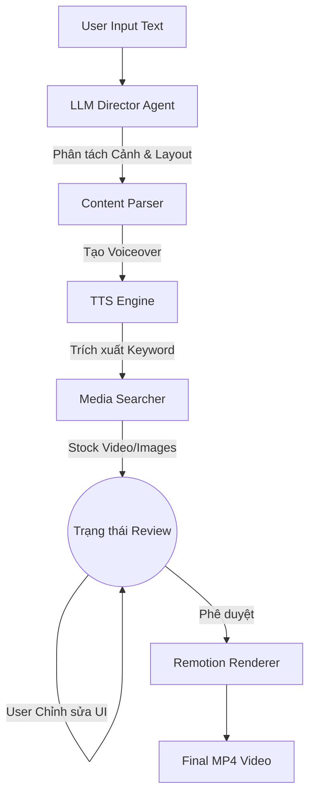

# Kiến trúc Tổng thể Dự án AutoClip (Auto Create Video)

> **Tài liệu Dành cho AI Assistant & Developer**
> Tài liệu này đóng vai trò là "bản đồ tư duy" (mental map) của hệ thống. Mọi AI Assistant khi làm việc với repo này CẦN đọc file này để hiểu context, boundaries và quy tắc thiết kế trước khi tiến hành viết code, refactor hoặc debug.

---

## 1. Tổng quan Hệ thống (System Overview)

AutoClip là một công cụ AI Local tạo video ngắn dọc (9:16) tự động từ văn bản. Hệ thống được chia làm 3 phân hệ chính giao tiếp với nhau qua API và Data Schema (Zod/Pydantic):

1. **Backend (Python / FastAPI / LangGraph)**: Não bộ của hệ thống. Chịu trách nhiệm quản lý User, Job, tương tác với LLMs (để chia scene, sinh kịch bản), gọi API tìm kiếm hình ảnh/video, tạo âm thanh (TTS), và quản lý tiến trình render.
2. **Frontend (React / Vite / Tailwind)**: Giao diện người dùng. Cung cấp Editor dạng Studio cho phép người dùng nhập văn bản, chỉnh sửa phân cảnh, thay đổi media, màu sắc và xem trước (preview) video ở thời gian thực.
3. **Render Engine (Remotion / React)**: Động cơ kết xuất video. Biến các thông số dữ liệu (JSON) từ Backend/Frontend thành các frame hình ảnh và ghép lại thành file MP4 hoàn chỉnh.

---

## 2. Luồng Dữ liệu Cốt lõi (Core Data Flow)

Hệ thống hoạt động theo pipeline dạng DAG (Directed Acyclic Graph), được điều phối bởi LangGraph ở Backend:

**Khế ước Dữ liệu (Data Contract):**
Trái tim của việc giao tiếp giữa 3 phân hệ là file `videoProps.ts` (Remotion) và `Job.props` (Database). Bất kỳ thay đổi nào về cấu trúc Video (thêm Scene mới, thêm hiệu ứng) **BẮT BUỘC** phải được khai báo đồng bộ ở Schema Backend và Zod Schema của Remotion.

---

## 3. Cấu trúc Thư mục và Nhiệm vụ

| Thư mục / Thành phần | Công nghệ | Vai trò (Bounded Context) |
|---|---|---|
| `/app` | Python, LangGraph | Logic AI Pipeline (chia scene, tìm media, gọi TTS). Đây là core business logic. |
| `/api` | FastAPI, SQLAlchemy | Web Server, REST API, Websocket/SSE cho UI, Database Auth, Upload file. |
| `/web` | React, Vite, Tailwind | UI/UX. Chứa các trang Dashboard, Create, Review. Giao tiếp Backend qua HTTP/SSE. |
| `/remotion`| React, Remotion | Engine render. Biến `videoProps` thành video. Chạy Preview trên UI và Render ra MP4 dưới background. |
| `/tests` | Pytest | Unit test và Integration test cho Backend. |

---

## 4. Quyết định Kiến trúc & Trade-offs (ADRs)

Dưới đây là các quyết định thiết kế quan trọng và sự đánh đổi:

### ADR-001: Tách biệt Remotion và Vite Frontend
- **Quyết định**: Giao diện UI nằm ở `/web` (Vite), còn core render nằm ở `/remotion`. Frontend import thẳng Player của Remotion để preview.
- **Trade-offs**:
  - *Được*: Code UI không bị dính chặt vào logic render. Có thể thay đổi giao diện độc lập.
  - *Mất*: Phải đồng bộ type cẩn thận. Việc hiển thị Preview có thể gặp lỗi về Cross-Origin hoặc Path (đặc biệt khi xử lý ảnh preview upload từ `/api/files/...`).

### ADR-002: Sử dụng Background Task thay vì Celery/Redis cho Local Tool
- **Quyết định**: Sử dụng in-process `BackgroundTasks` và cơ chế pub/sub cục bộ cho tiến trình tạo video thay vì setup Celery/Redis phức tạp.
- **Trade-offs**:
  - *Được*: Rất dễ cài đặt (Zero-config cho người dùng local), siêu nhẹ.
  - *Mất*: Không scale ra nhiều worker server được (phù hợp với định hướng công cụ cá nhân / local).

### ADR-003: Quản lý URL tĩnh qua API Proxy (Security)
- **Quyết định**: Không serve file tĩnh công khai. Mọi file ảnh/video preview được bọc qua endpoint `/api/files/...` kèm token (Signed URLs).
- **Trade-offs**:
  - *Được*: Bảo mật dữ liệu người dùng.
  - *Mất*: Xử lý URL phức tạp. AI Helper CẦN lưu ý: Khi frontend xử lý file upload, phải dùng `preview_url` (đã có token) để hiển thị, nhưng lưu vào Database thì chỉ lưu relative path. Khi Remotion chạy render ở server, nó sẽ dùng `staticFile()` để đọc path cục bộ.

## 5. Hướng dẫn Mở rộng & Sửa chữa (Cheat Sheet cho AI)

- **Muốn thêm 1 Scene Type mới?**
  1. Thêm prompt vào `app/nodes/agents/director.py`.
  2. Khai báo Schema tại Backend (`app/state.py` hoặc schema parser).
  3. Thêm type vào Zod enum ở `remotion/src/schemas/videoProps.ts`.
  4. Tạo file component UI cho scene tại `remotion/src/scenes/NewScene.tsx`.
  5. Đăng ký component vào `remotion/src/AutoClipVideo.tsx`.
- **Lỗi không hiện hình ảnh/video?**
  - Kiểm tra xem URL trả về là Local Path hay Signed URL. Nếu đang ở trình duyệt (Web/ReviewView), URL bắt buộc phải đi qua `/api/files/...` (có token). Nếu đang trong lúc Render MP4, URL đi qua `staticFile()`.
- **Lỗi giao diện (Frontend) hoặc Remotion không update?**
  - Nhớ rằng `/web` cần phải chạy lệnh `npm run build` thì Backend FastAPI mới serve được giao diện mới nhất ở đường dẫn `/` tĩnh.

---
*Ký tên: Antigravity Architect Agent*
