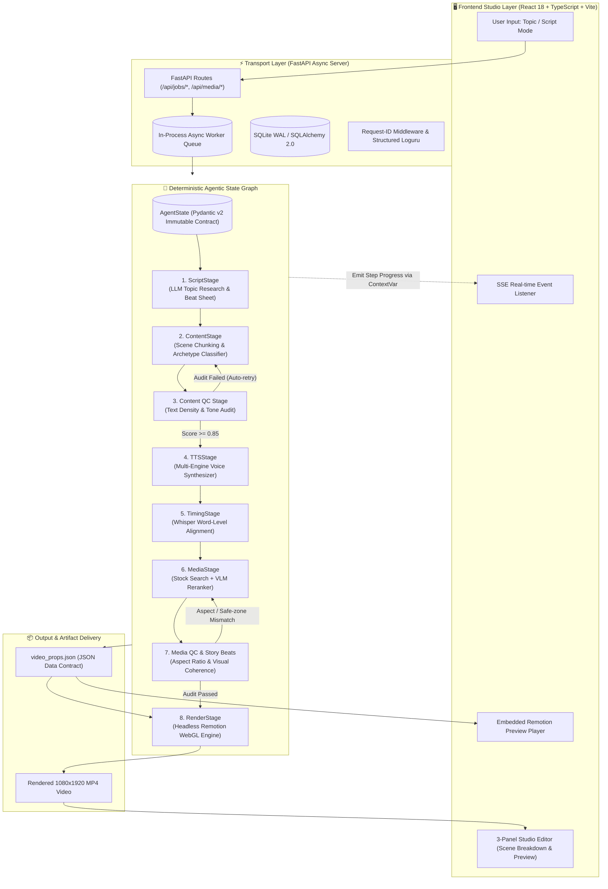

<div align="center">

# 🎬 AutoClip — AI-Driven Programmatic Video Engine
### *An End-to-End Multimodal Agentic Pipeline for Automated Short-Form Content Generation*

[](https://python.org)
[](https://fastapi.tiangolo.com)
[](https://react.dev)
[](https://remotion.dev)
[](https://www.typescriptlang.org)
[](https://docs.pydantic.dev)
[](LICENSE)

<p align="center">
  <b>Biến văn bản hoặc ý tưởng thành video ngắn dọc (9:16) hoàn chỉnh với độ đồng bộ âm thanh - phụ đề dưới 10ms, cơ chế chấm điểm thị giác VLM Reranking và kiến trúc Deterministic Agentic State Graph.</b>
</p>

[System Architecture](#-system-architecture) • [AI/ML Pipeline Deep-Dive](#-aiml-pipeline-deep-dive) • [Engineering Highlights](#-key-engineering-highlights--trade-offs) • [Technical Stack](#-technical-stack) • [Quickstart Guide](#-quickstart--developer-guide) • [API Spec](#-api-reference-overview)

</div>

---

## 📌 Executive Summary

**AutoClip** là một hệ thống tạo video tự động đa phương thức (Multimodal Video Generation Engine) toàn diện, tự động hóa 100% quy trình sản xuất nội dung ngắn (TikTok, YouTube Shorts, Reels): từ nghiên cứu đề tài, sinh kịch bản (Scripting), tổng hợp giọng nói (Multi-TTS), trích xuất mốc thời gian phụ đề theo từng từ (Whisper Forced Alignment), tuyển chọn và chấm điểm stock media bằng mô hình thị giác (VLM Reranking), đến dựng video tự động bằng mã nguồn (Programmatic Video Rendering qua Remotion).

Khác với các công cụ bọc API (API wrappers) đơn giản, AutoClip được xây dựng trên nền tảng **Deterministic Agentic State Graph** với hợp đồng dữ liệu Pydantic v2 chặt chẽ, chu trình kiểm duyệt chất lượng tự phục hồi (Self-Healing QC Stage), và kiến trúc streaming sự kiện thời gian thực (SSE).

### 🎯 Key Performance & System Metrics
- **Thời gian xử lý End-to-End:** ~30–45 giây cho một video dọc chuẩn 1080x1920 @ 30fps dài 60 giây.
- **Độ chính xác đồng bộ Audio - Subtitle:** Sai số < 10ms nhờ cơ chế Whisper Word-Level Alignment.
- **Khả năng chịu lỗi & Tiết kiệm chi phí:** Hệ thống phân đoạn (Stage Isolation) có bộ đệm trạng thái (State Caching). Khi một tác vụ bị gián đoạn hoặc cần re-render, hệ thống tự động bỏ qua các bước tốn phí LLM/TTS đã hoàn thành.
- **Zero-Heavy-Infra Footprint:** Tối ưu hóa cho môi trường local lẫn cloud với Async In-Process Queue và SQLite WAL mode (không bắt buộc cài đặt Redis/Celery cồng kềnh cho môi trường phát triển).

---

## 🏗️ System Architecture

Hệ thống được thiết kế theo nguyên lý **Phân tách trách nhiệm (Separation of Concerns)** với 3 phân tầng cốt lõi:
1. **Agentic Orchestration Layer (Python / FastAPI):** State machine điều phối các LLM workers, multi-engine TTS, VLM reranker, và Whisper alignment.
2. **Real-time Transport Layer (SSE & REST API):** Cơ chế truyền dữ liệu bất đồng bộ với Server-Sent Events, truyền trực tiếp tiến độ của từng stage về Frontend.
3. **Studio & Rendering Layer (React + Remotion + WebGL):** Giao diện Studio 3-panel cho phép người dùng tùy biến kịch bản, màu sắc, media và hệ thống headless renderer xuất file MP4.



---

## 🧠 AI/ML Pipeline Deep-Dive

### 1. Deterministic State Graph vs. Stochastic Autonomous Loops
Các hệ thống multi-agent dạng vòng lặp mở (Open-ended Autonomous Loops) thường gặp vấn đề nghiêm trọng: vòng lặp vô tận (infinite loops), chi phí token không kiểm soát và khó tái hiện lỗi. AutoClip giải quyết triệt để bằng **Directed Acyclic Graph (DAG) State Machine**:
- **Hợp đồng dữ liệu bất biến (Immutable State):** Mỗi stage nhận vào `AgentState`, thực hiện xử lý cô lập và trả về phiên bản copy mới qua `state.model_copy()`.
- **Theo dõi chi phí thời gian thực:** Mọi lệnh gọi model đều lưu lại `TokenUsage` ghi nhận số token In/Out và chi phí USD tức thì (`calc_cost`).
- **Resilient State Caching:** Nếu render bị hủy hoặc lỗi ở bước cuối, khi chạy lại, pipeline sẽ đọc trạng thái đã lưu và tự động bỏ qua toàn bộ các bước LLM, TTS, Media đã hoàn thành.

### 2. Tuyển chọn Visual bằng Vision-Language Model (VLM Reranking)
Tìm kiếm stock media bằng từ khóa truyền thống (keyword matching) thường mang lại kết quả thiếu ngữ cảnh hoặc sai lệch cảm xúc. AutoClip tích hợp **VLM Reranking Engine**:
- Gửi các khung hình thumbnail ứng viên cùng với câu thoại (narration) và tông giọng cảm xúc của phân cảnh vào mô hình Vision (GPT-4o Vision / Qwen-VL).
- Đánh giá độ phù hợp ngữ nghĩa, sự an toàn của chủ thể trong vùng hiển thị 9:16 (safe zone), và mức độ hài hòa thị giác.
- Trả về điểm số trọng số ($0.0 \to 1.0$) và thông tin kiểm duyệt `SceneAudit` để chọn ra media hoàn hảo nhất.

```text
Stock API Candidates ──> [VLM Reranker] ──> Semantic Match Score (0.94) ──> Selected Media
                                       ──> 9:16 Subject Safe-Zone (Pass)
                                       ──> Narrative Emotion Match (High)
```

### 3. Đồng bộ phụ đề sub-second với Whisper Forced Alignment
Hiệu ứng chữ chạy động (karaoke-style dynamic subtitles) đòi hỏi mốc thời gian ở mức mili-giây:
- Tổng hợp giọng nói qua **5 engine TTS**: Edge-TTS, ElevenLabs, OpenAI TTS, Gemini Voice, Vbee.
- Đưa luồng audio sang **OpenAI Whisper** để trích xuất mốc thời gian chuẩn xác theo từng từ.
- Sinh ra danh sách `WordTimestamp` (`start_ms`, `end_ms`), loại bỏ hoàn toàn hiện tượng lệch tiếng (audio-subtitle desync).

### 4. Stage Kiểm soát Chất lượng Tự động (Self-Healing QC Agent)
Trước khi tốn tài nguyên render video, hệ thống thực hiện kiểm định tự động qua `QCStage`:
- **Audio Cadence Check:** Đảm bảo độ dài câu thoại phù hợp với tốc độ đọc tự nhiên, không bị ngắt cụt hay tràn thời gian.
- **Visual Contrast & Safe-Zone:** Kiểm tra độ tương phản giữa màu chữ phụ đề và bảng màu nền (`ColorPalette`), đảm bảo chuẩn tiếp cận WCAG.
- **Self-Healing Loop:** Nếu điểm số đánh giá nội dung thấp hơn ngưỡng (`QC_THRESHOLD_CONTENT = 0.85`), hệ thống kích hoạt lượt retry tự động kèm prompt tinh chỉnh hướng giải quyết.

---

## 🎨 Programmatic Video Engine (Remotion)

Thay vì xuất video bằng các template dựng sẵn khô cứng, AutoClip sử dụng **Remotion** để lập trình video hoàn toàn bằng React và Canvas:

| Scene Archetype | Minh họa & Bố cục Thị giác |
|---|---|
| `info_card` | Thẻ kính mờ (Glassmorphism) chứa icon động, tiêu đề và các luận điểm chính. |
| `stats_highlight` | Bộ đếm số tăng dần (animated number ticker) nhấn mạnh số liệu và phần trăm tăng trưởng. |
| `comparison` | Bảng so sánh 2 cột trực quan (Ưu/Nhược điểm, A vs B) có phân màu cảm xúc (positive/negative). |
| `timeline` | Dòng thời gian hiển thị chuỗi sự kiện với hiệu ứng đường sáng phát triển dần. |
| `diagram` | Đồ thị toán học, biểu đồ đường hoặc biểu đồ phân tán vẽ động qua Canvas & LaTeX. |
| `story_beats` | Thẻ nhịp câu chuyện ngắn (micro-ideas) kích hoạt icon emoji theo ngữ điệu người nói. |
| `cryptovn101_news` | Khung tin tức thời sự chuyên nghiệp với dải chữ chạy (ticker marquee) và thẻ phân loại tin. |

### Dynamic Theming & Color Harmonies
AI tự động trích xuất ngữ cảnh kịch bản để tạo ra bộ màu `ColorPalette` (Primary, Secondary, Background, Text) tối ưu cho từng chủ đề (Công nghệ, Tài chính, Đời sống, v.v.).

---

## 💻 Technical Stack

```text
Auto-create-Video/
├── 🤖 AI & Machine Learning
│   ├── LangGraph / StateGraph    # Deterministic pipeline state machine
│   ├── OpenAI GPT-4o / Qwen-3.5  # Scriptwriting, Beat-sheet, Content parsing
│   ├── Whisper Alignment         # Word-level timestamping (sub-10ms precision)
│   ├── Vision LLM (VLM)          # Stock media candidate aesthetic & semantic reranking
│   └── Multi-Engine TTS          # Edge-TTS, ElevenLabs, OpenAI, Gemini, Vbee
│
├── ⚡ Backend Services
│   ├── Python 3.13 / FastAPI    # Asynchronous high-performance REST framework
│   ├── Pydantic v2               # Strict schemas and JSON data contracts
│   ├── SQLAlchemy 2.0 + SQLite   # Persistence with WAL mode for zero-config concurrency
│   ├── In-Process Async Queue    # Non-blocking async job queue with status broadcasting
│   └── Server-Sent Events (SSE)  # ContextVar-driven real-time progress emitter
│
├── 🖥️ Frontend & Studio
│   ├── React 18 + TypeScript     # Single Page Application with end-to-end type safety
│   ├── Vite                      # Modern build tool & instantaneous HMR dev server
│   ├── TailwindCSS + Radix UI    # Dark-mode design system & accessible component primitives
│   └── Lucide Icons              # Crisp vector iconography
│
└── 🎬 Video Compositor & Rendering
    ├── Remotion 4.0              # React-based programmatic video rendering framework
    ├── FFmpeg                    # Audio-video muxing, encoding, transcode pipeline
    └── WebGL / HTML5 Canvas      # Smooth 60fps chart rendering and particle effects
```

---

## 🛠️ Key Engineering Highlights & Trade-offs

### 1. In-Process Async Queue vs. Celery/Redis
* **Quyết định:** Sử dụng hàng đợi bất đồng bộ nội tuyến `asyncio.Queue` kết hợp cơ sở dữ liệu SQLite cấu hình chế độ WAL (Write-Ahead Logging).
* **Lý do:** Loại bỏ sự phụ thuộc phức tạp vào daemon Redis/Celery khi chạy local, giúp developer khởi động dự án chỉ với một lệnh, trong khi vẫn bảo đảm tính bất đồng bộ không chặn luồng chính của FastAPI. Sẵn sàng đóng gói container để scale ngang trên cloud khi cần.

### 2. An toàn kiểu dữ liệu xuyên suốt (Python Pydantic $\to$ TypeScript Zod)
* **Vấn đề:** Python sử dụng quy ước `snake_case`, trong khi React và Remotion sử dụng `camelCase`.
* **Giải pháp:** Xây dựng hợp đồng dữ liệu chuẩn tại `app/state.py` với `model_dump(by_alias=True)`. Phía Remotion tự động chuyển đổi qua `camelizeKeys()` và xác thực bằng Zod schema, đảm bảo không bao giờ gặp lỗi Runtime Type Error khi render video.

### 3. Real-Time Observability với SSE và Python ContextVar
* **Vấn đề:** Cần phát tiến độ của các node xử lý nằm sâu trong pipeline ra client mà không gây nghẽn luồng hay phải thăm dò (polling) liên tục.
* **Giải pháp:** Triển khai `app/progress.py` dựa trên `contextvars.ContextVar`. Mọi stage hoặc sub-worker đều có thể phát tín hiệu tiến độ một cách độc lập, truyền thẳng tới trình duyệt người dùng qua endpoint `/api/jobs/stream/{job_id}`.

---

## 🚀 Quickstart & Developer Guide

### Yêu cầu hệ thống
- **Python:** $\ge$ 3.11
- **Node.js:** $\ge$ 18.0
- **FFmpeg:** Đã cài đặt và có trong biến môi trường `PATH`

### Bước 1: Clone Repository & Cấu hình môi trường
```bash
git clone https://github.com/Duy137/Auto-create-Video.git
cd Auto-create-Video

# Tạo file cấu hình môi trường
cp .env.example .env
```

Mở file `.env` và thiết lập các API key:
```env
OPENAI_API_KEY=sk-proj-...        # Bắt buộc: Xử lý LLM & Whisper alignment
PEXELS_API_KEY=...               # Bắt buộc: Tìm kiếm stock video/ảnh
ELEVENLABS_API_KEY=...           # Tùy chọn: Giọng đọc AI chất lượng cao
```

### Bước 2: Cài đặt Dependencies (Backend, Web & Remotion)
```bash
# 1. Cài đặt Python Virtual Environment & Backend dependencies
python -m venv .venv
source .venv/bin/activate       # Trên Windows: .venv\Scripts\activate
pip install -r requirements.txt

# 2. Cài đặt Frontend Web Studio dependencies
cd web
npm install
cd ..

# 3. Cài đặt Remotion Video Engine dependencies
cd remotion
npm install
cd ..
```

---

## 🏃‍♂️ Hướng dẫn khởi chạy hệ thống

Dự án hỗ trợ 2 chế độ chạy linh hoạt:

### Chế độ 1: Môi trường Phát triển (Development Mode - Khuyên dùng)
Mở 2 cửa sổ terminal:

* **Terminal 1 (Backend API):**
  ```bash
  uvicorn api.main:app --port 8000 --reload
  ```
* **Terminal 2 (Frontend Studio):**
  ```bash
  cd web
  npm run dev
  ```
👉 Truy cập giao diện Studio tại: **http://localhost:5173** (Hỗ trợ Hot-Reload tự động khi sửa code UI).

### Chế độ 2: Môi trường Sản xuất (Production Single-Port Mode)
Biên dịch Frontend thành tài nguyên tĩnh để FastAPI phục vụ trực tiếp trên một cổng duy nhất:
```bash
cd web
npm run build
cd ..
uvicorn api.main:app --port 8000
```
👉 Truy cập trực tiếp toàn bộ hệ thống tại: **http://localhost:8000**.

---

## 📡 API Reference Overview

| Endpoint | Method | Chức năng chính |
|---|---|---|
| `/api/jobs/create` | `POST` | Tiếp nhận yêu cầu tạo video mới (chế độ Topic hoặc Script). |
| `/api/jobs/{job_id}` | `GET` | Lấy chi tiết trạng thái, state hiện tại và đường dẫn artifacts. |
| `/api/jobs/stream/{job_id}` | `GET` | Luồng SSE phát tiến độ xử lý và thông tin chi tiết từng stage theo thời gian thực. |
| `/api/jobs/{job_id}/render` | `POST` | Kích hoạt Remotion headless render với dữ liệu `video_props` đã chỉnh sửa. |
| `/api/media/search` | `GET` | Tìm kiếm kho media stock kèm phân trang và từ khóa dự phòng. |
| `/api/audio/tts-preview` | `POST` | Sinh thử audio voice mẫu trực tiếp trên giao diện để người dùng nghe trước. |

---

## 📁 Cấu trúc Thư mục Dự án

```text
Auto-create-Video/
├── api/                    # Tầng Transport REST API & Web Server (FastAPI)
│   ├── main.py             # Entrypoint server, CORS, static files, tracing middleware
│   ├── routes.py           # Định nghĩa toàn bộ REST endpoints & SSE streaming
│   └── database.py         # Cấu hình SQLAlchemy 2.0 & SQLite WAL mode
│
├── app/                    # Tầng Nghiệp vụ Cốt lõi & Agentic Pipeline
│   ├── state.py            # Hợp đồng dữ liệu Pydantic v2 (AgentState, VideoProps, Scenes)
│   ├── progress.py         # Bộ phát tiến độ SSE dựa trên contextvars
│   ├── pipeline/
│   │   ├── graph.py        # Pipeline State Graph điều phối thứ tự các công đoạn
│   │   ├── stages/         # Các stage quản lý (Script, Content, TTS, Media, QC, Render)
│   │   └── nodes/          # Logic chi tiết từng worker (Whisper aligner, VLM reranker...)
│   └── utils/              # Tiện ích bổ trợ (Color theme, text preprocessor, video settings)
│
├── web/                    # Giao diện người dùng Web Studio (React 18 + Vite)
│   ├── src/pages/          # Màn hình chính (Create, Studio/Review, Dashboard, Results)
│   ├── src/components/     # Thư viện component tái sử dụng (Player, Timeline, Scene Card)
│   └── src/api/            # API client giao tiếp với FastAPI backend
│
├── remotion/               # Động cơ dựng video theo mã nguồn (Remotion Engine)
│   └── src/                # AutoClipVideo.tsx và các template bố cục phân cảnh
│
└── config.py               # Quản lý các biến môi trường và thiết lập hệ thống
```

---

## 👨‍💻 Tác giả & Thông tin Liên hệ (Portfolio Contact)

- **Tác giả:** AI / Full-Stack Engineer
- **Lĩnh vực chuyên sâu:** Multimodal AI Pipelines, Agentic Workflows & State Machines, Programmatic Video Synthesis, High-Performance Async Architecture.
- **GitHub:** [@Duy137](https://github.com/Duy137)

---
<div align="center">
  <sub>Được thiết kế và hoàn thiện với tiêu chuẩn kỹ thuật cao phục vụ sản xuất nội dung AI tự động hóa.</sub>
</div>