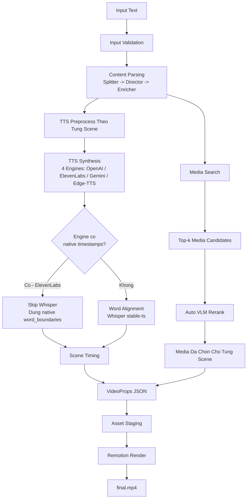

# Kien Truc He Thong AutoClip - Ban Ngan Gon

## So Do Workflow



## 1. Muc Tieu

AutoClip la he thong chuyen van ban tieng Viet thanh video ngan 9:16.

Input:
- Text
- Voice (4 engines: OpenAI, ElevenLabs, Gemini, Edge-TTS)
- Speech rate
- Model selection (cho ElevenLabs va Gemini)

Output:
- Audio narration (MP3)
- Word timestamps (native hoac Whisper)
- VideoProps JSON
- final.mp4

## 2. Luong Xu Ly Chinh

```text
Text
   -> Validate Input
   -> Parse thanh Scenes
   -> [TTS + Word Alignment] song song voi [Media Search]
      TTS: Chon engine (openai/elevenlabs/gemini/edge-tts)
      Neu engine co native timestamps (ElevenLabs) -> skip Whisper
      Neu khong -> chay Whisper alignment
   -> Scene Timing (dua tren audio duration - mutagen)
   -> VideoProps JSON
   -> Render MP4
```

## 3. Cac Khoi He Thong

```text
Entry
   run_pipeline.py / api.main

Orchestrator
   app/orchestrator.py

Core Nodes
   input_validator
   content_parser
   tts_preprocessor
   tts_synthesizer (4 engines: OpenAI, ElevenLabs, Gemini, EdgeTTS)
   word_aligner (Whisper - smart skip khi co native timestamps)
   media_searcher
   media_reranker
   video_renderer

Shared Helpers
   _get_audio_duration_ms (mutagen - do chinh xac)
   _apply_speech_rate_ffmpeg (ffmpeg atempo 0.5x-4.0x)
   _chars_to_word_timestamps (ElevenLabs char->word aggregation)

Contract
   app/state.py

Renderer
   remotion/
```

## 4. Chuc Nang Tung Buoc

### 4.1. Input Validation
- Lam sach input
- Kiem tra do dai va canh bao

### 4.2. Content Parsing
- Tach text thanh scene
- Gan `scene_type`, `purpose`, `layout`, `transition`
- Tao media query va mo ta hinh anh

Parser dung 3 phase:
- Splitter
- Director
- Enricher

### 4.3. TTS + Word Alignment
- Moi scene narration duoc preprocess rieng
- TTS synthesize tu processed text
- 4 TTS engines:
  - OpenAI (gpt-4o-mini-tts): Primary, speech rate qua API param
  - ElevenLabs (v3/Flash v2.5): Premium, native word timestamps, speed 0.7-1.2
  - Gemini (3.1 Flash TTS): LLM-powered, PCM->WAV->MP3, rate qua ffmpeg atempo
  - Edge-TTS: Free fallback, async native
- Smart Whisper skip: Neu engine tra ve word_boundaries (ElevenLabs) -> bo qua Whisper
- Audio duration do chinh xac bang mutagen (thay byte-estimate)

Y nghia:
- Giu subtitle va timing bam dung audio
- Tranh lech scene khi text bi doi token nhu `AI -> A.I.`
- ElevenLabs tiet kiem thoi gian alignment (~3-5s/video)

### 4.4. Media Search + Rerank
- Tim media theo query cho tung scene
- Thu top-k candidates
- VLM rerank de chon media phu hop nhat

Trong demo flow, rerank chay tu dong truoc khi review.

### 4.5. Scene Timing
- Dung `word_timestamps`
- Dung `processed_word_counts` theo tung scene
- Fallback sang timing proportional neu alignment loi

### 4.6. Render
- Tao `video_props.json`
- Stage asset cho Remotion
- Render ra `final.mp4`

## 5. Hai Cach Chay He Thong

### CLI
- Chay qua `run_pipeline.py`
- Phu hop de test pipeline end-to-end

### Web App (Modern Studio)
- Chay qua `api/main.py` (Production) hoac Vite (Development)
- Giao dien 3-pane Studio (TypeScript + Shadcn UI + Tailwind CSS)
- 4 TTS engines voi UI chon voice/model rieng:
   - OpenAI: 9 voices (Alloy, Nova, etc.)
   - ElevenLabs: 10 Vietnamese voices + custom Voice ID + model picker
   - Gemini: 16 voices (9 nam + 7 nu) + model picker (3.1 Flash/2.5 Flash/2.5 Pro)
   - Edge-TTS: 3 voices (vi-VN/en-US)
- Luồng:
   - Login/Register (JWT Authentication)
   - Setup: Nhập text + tùy chỉnh TTS (Voice, Rate, Volume) & Background Music
   - Processing: Theo dõi tiến trình live qua SSE stream
   - Review: Studio Editor 3-pane (Live preview qua @remotion/player, sửa Scene props, re-search media)
   - Render: Kết xuất final MP4 và tải về

## 6. Diem Ky Thuat Noi Bat

1. Alignment bam vao text da synthesize, khong bam vao raw narration.
2. Scene timing dua tren audio that (mutagen), khong dua tren byte estimate.
3. Media selection la 2 tang: search truoc, rerank sau.
4. Python xu ly logic; Remotion chi render theo JSON contract.
5. Smart Whisper skip: ElevenLabs co native timestamps -> bo qua Whisper alignment.
6. 4 TTS engines voi generic cache factory (model-aware cache key).
7. TTS preview endpoint dung chung get_tts_engine() factory cho tat ca engines.
8. ffmpeg atempo post-processing cho speech rate khi engine khong ho tro native speed.

## 7. Artefact Dau Ra

- `output/<job_id>/video_props.json`
- `output/<job_id>/video_props_render.json`
- `output/<job_id>/audio/full.mp3`
- `output/<job_id>/media/*`
- `output/<job_id>/final.mp4`

## 8. File Quan Trong

- `app/orchestrator.py`         # Pipeline orchestration + smart Whisper skip
- `app/state.py`                # VideoProps Pydantic model
- `app/nodes/tts_synthesizer.py` # 4 TTS engines + helpers
- `web/src/pages/CreatePage.tsx`   # State machine cho tao video
- `web/src/sections/SetupView.tsx`  # TTS engine/voice/model UI
- `web/src/sections/ReviewView.tsx` # Studio Editor logic
- `web/src/api/client.ts`         # Typed API client
- `remotion/src/AutoClipVideo.tsx` # Remotion composition
- `config.py`                    # 4 API keys + env config

## 9. Tom Tat 1 Cau

AutoClip la pipeline AI bien text thanh video ngan bang cach tach scene, sinh voice (4 TTS engines voi smart Whisper skip), can chinh timestamp (native hoac Whisper), chon media bang search + VLM rerank, sau do render qua Remotion.