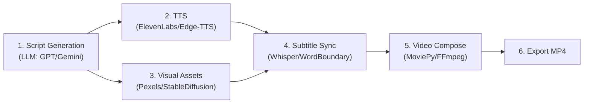

# 🔬 AutoClip — Báo Cáo Nghiên Cứu Case Study

**Ngày nghiên cứu:** 2026-04-11  
**Người thực hiện:** AI Research Assistant  
**Mục tiêu:** Khảo sát các dự án mã nguồn mở và kỹ thuật liên quan tới pipeline "Text → Short Video" để rút ra bài học, source code tham khảo và cảnh báo rủi ro cho dự án AutoClip.
 
---

## Mục lục

- [1. Tổng quan hệ sinh thái dự án mã nguồn mở](#1-tổng-quan-hệ-sinh-thái-dự-án-mã-nguồn-mở)
  - [1.1. Kiến trúc pipeline chung](#11-kiến-trúc-pipeline-chung)
  - [1.2. Bảng phân tích chi tiết từng dự án](#12-bảng-phân-tích-chi-tiết-từng-dự-án)
  - [1.3. Các thư viện phụ đề chuyên dụng](#13-các-thư-viện-phụ-đề-chuyên-dụng)
  - [1.4. So sánh tổng thể với AutoClip](#14-so-sánh-tổng-thể-với-autoclip)
- [2. Đồng bộ Text & Audio — Edge-TTS WordBoundary](#2-đồng-bộ-text--audio--edge-tts-wordboundary)
  - [2.1. Edge-TTS Overview](#21-edge-tts-overview)
  - [2.2. Cơ chế WordBoundary](#22-cơ-chế-wordboundary)
  - [2.3. Đơn vị Ticks → Milliseconds](#23-đơn-vị-ticks--milliseconds)
  - [2.4. ⚠️ SSML đã bị loại bỏ](#24-️-phát-hiện-quan-trọng-ssml-đã-bị-loại-bỏ)
  - [2.5. Chiến lược fallback](#25-chiến-lược-fallback-whisper-forced-alignment)
- [3. So sánh Rendering Engines](#3-so-sánh-rendering-engines)
  - [3.1. Bảng so sánh tổng quan](#31-bảng-so-sánh-tổng-quan)
  - [3.2. Chi tiết từng approach](#32-chi-tiết-từng-approach)
  - [3.3. Tối ưu Pillow rendering](#33-tối-ưu-pillow-rendering)
- [4. Phát hiện quan trọng & Tác động tới Implementation Plan](#4-phát-hiện-quan-trọng--tác-động-tới-implementation-plan)
- [5. Khuyến nghị hành động](#5-khuyến-nghị-hành-động)

---

## 1. Tổng quan hệ sinh thái dự án mã nguồn mở

### 1.1. Kiến trúc pipeline chung

Trên GitHub hiện có hàng chục dự án mã nguồn mở giải quyết bài toán "Faceless Short Video Generation". Mặc dù khác nhau về chi tiết, **tất cả đều tuân theo một kiến trúc pipeline tuần tự gồm 4-6 bước:**

```
Script/Text → TTS Audio → Visual Assets → Subtitle Sync → Video Composition → Export MP4
```



**Tech Stack phổ biến nhất:**

| Khâu | Công nghệ phổ biến |
|------|-------------------|
| **Orchestration** | Python scripts, LangChain (prompt management) |
| **LLM** | OpenAI GPT-4o, Google Gemini |
| **TTS** | ElevenLabs (trả phí), Edge-TTS (free), gTTS (chất lượng thấp) |
| **Visual Assets** | Pexels API (free stock), Stable Diffusion (AI gen) |
| **Video Processing** | MoviePy, FFmpeg, OpenCV |
| **Subtitles** | Whisper (transcribe), ASS/SRT format |
| **Config** | Pydantic, python-dotenv |
| **UI** | Streamlit (nhanh) hoặc FastAPI + Web frontend |

---

### 1.2. Bảng phân tích chi tiết từng dự án

#### A — Dự án Pipeline đầy đủ (Text/Topic → Video)

---

#### 🏆 MoneyPrinterTurbo
| Thuộc tính | Chi tiết |
|-----------|---------|
| **GitHub** | [harry0703/MoneyPrinterTurbo](https://github.com/harry0703/MoneyPrinterTurbo) |
| **Stars** | ~18K ⭐ (dự án phổ biến nhất) |
| **Stack** | Python + MoviePy + FFmpeg + Multiple LLMs |
| **TTS** | Hỗ trợ nhiều engine (Azure TTS, Edge-TTS, gTTS...) |
| **Visual** | Pexels / Pixabay stock footage |
| **UI** | Web UI built-in |
| **Deploy** | Docker support |

**Cơ chế hoạt động:**
1. User nhập **topic/keyword** → LLM (GPT, Gemini, hoặc Ollama local) sinh script
2. Script → TTS → Audio MP3
3. Keywords → Pexels/Pixabay → stock clips
4. MoviePy ghép tất cả + subtitle overlay → MP4

**Ưu điểm:** Hỗ trợ nhiều LLM providers, Docker deploy, Web UI hoàn chỉnh, community lớn.  
**Nhược điểm:** LLM tự viết script (AutoClip không làm điều này), subtitle sync chưa word-level.  
**Bài học cho AutoClip:** Tham khảo cách tổ chức multi-provider TTS, fallback logic, Docker deployment.

---

#### 🎬 AI-Video-Gen (ARABIAN AI SCHOOL)
| Thuộc tính | Chi tiết |
|-----------|---------|
| **GitHub** | [Arabianaischool/AI-Video-Gen-by-ARABIAN-AI-SCHOOL](https://github.com/Arabianaischool/AI-Video-Gen-by-ARABIAN-AI-SCHOOL) |
| **Stars** | ~500 ⭐ |
| **Stack** | FastAPI + Google Gemini + ElevenLabs + MoviePy |
| **TTS** | ElevenLabs (trả phí, chất lượng cao) |
| **Visual** | AI gen images + stock fetch |

**Cơ chế hoạt động:**
1. User nhập topic → Gemini sinh script với JSON cấu trúc
2. ElevenLabs → voiceover
3. Fetch/Generate images → resize cho video
4. MoviePy + FFmpeg compose → captions overlay → MP4

**Ưu điểm:** Kiến trúc FastAPI giống AutoClip, dùng Gemini cho parsing.  
**Nhược điểm:** ElevenLabs tốn phí, không có human-in-the-loop.  
**Bài học cho AutoClip:** Tham khảo cấu trúc FastAPI endpoints, cách Gemini parse script thành JSON.

---

#### 🎞️ AI-Youtube-Shorts-Generator (SamurAIGPT)
| Thuộc tính | Chi tiết |
|-----------|---------|
| **GitHub** | [SamurAIGPT/AI-Youtube-Shorts-Generator](https://github.com/SamurAIGPT/AI-Youtube-Shorts-Generator) |
| **Stars** | ~2K ⭐ |
| **Stack** | Python + Whisper + GPT-4o-mini + MoviePy + OpenCV |
| **TTS** | N/A (repurpose existing audio) |
| **Docs** | [Mintlify documentation](https://docs.samuraigpt.com/) |

**Cơ chế hoạt động:**
1. Input: YouTube URL hoặc video file
2. Whisper transcribe → full transcript
3. GPT-4o-mini phân tích → chọn highlight segments (45-60s)
4. MoviePy + OpenCV → crop 16:9 → 9:16 (face tracking smart crop)
5. Burn subtitles → export MP4

**Ưu điểm:** Smart face tracking khi crop video, styled subtitles.  
**Nhược điểm:** Chỉ repurpose video có sẵn, không phải text-to-video from scratch.  
**Bài học cho AutoClip:** Tham khảo cách render styled subtitles, OpenCV face detection cho future features.

---

#### 📖 Faceless Video Generator (jacky-xbb)
| Thuộc tính | Chi tiết |
|-----------|---------|
| **GitHub** | [jacky-xbb/faceless-video-generator](https://github.com/jacky-xbb/faceless-video-generator) |
| **Stars** | ~300 ⭐ |
| **Stack** | Python + AI TTS + MoviePy |

**Cơ chế hoạt động:**
1. Script generation (AI) → story script
2. AI image generation cho từng cảnh
3. TTS voiceover
4. MoviePy stitching + subtitle

**Ưu điểm:** Đơn giản, dễ hiểu codebase.  
**Nhược điểm:** Story-based (chỉ phù hợp content kể chuyện), không có scene type đa dạng.  
**Bài học cho AutoClip:** Tham khảo cách chia script thành scenes đơn giản.

---

#### 🎥 ReelsMaker (steinathan)
| Thuộc tính | Chi tiết |
|-----------|---------|
| **GitHub** | [steinathan/reelsmaker](https://github.com/steinathan/reelsmaker) |
| **Stars** | ~200 ⭐ |
| **Stack** | Streamlit + Python + MoviePy |

**Cơ chế hoạt động:**
1. Streamlit UI → user nhập content
2. Multiple TTS engine support
3. MoviePy compose → 9:16 format
4. Export cho TikTok/Reels

**Ưu điểm:** Streamlit UI nhanh, TikTok-optimized format.  
**Nhược điểm:** UI prototype chất lượng, không production-ready.  
**Bài học cho AutoClip:** Tham khảo UX flow nhập content → preview → export.

---

### 1.3. Các thư viện phụ đề chuyên dụng

Đây là các thư viện chuyên xử lý **subtitle/caption** có thể tham khảo cho khâu Dynamic Captions của AutoClip:

---

#### 🎨 PyCaps — CSS-styled animated captions
| Thuộc tính | Chi tiết |
|-----------|---------|
| **GitHub** | [francozanardi/pycaps](https://github.com/francozanardi/pycaps) |
| **PyPI** | `pip install pycaps` |
| **Stars** | ~400 ⭐ |
| **Trạng thái** | Alpha |

**Đặc điểm:**
- Template system với **CSS styling** (fonts, colors, shadows, animations)
- Built-in animation presets: fades, pops, slides
- AI-powered tagging: highlight từ theo ngữ cảnh tự động
- `.word-being-narrated` CSS class cho karaoke effect
- Dùng Whisper cho transcription + FFmpeg cho rendering

```python
from pycaps import CapsPipelineBuilder

pipeline = (
    CapsPipelineBuilder()
    .with_input_video("input.mp4")
    .add_css("styles.css")
    .build()
)
pipeline.run()
```

**Bài học cho AutoClip:** Ý tưởng CSS-based styling system cho captions rất hay. Có thể tham khảo cách highlight từ đang đọc.

---

#### ⚡ tiktokcaptions — Simple TikTok-style captions
| Thuộc tính | Chi tiết |
|-----------|---------|
| **PyPI** | [tiktokcaptions](https://pypi.org/project/tiktokcaptions/) |
| **Dependency** | Whisper + FFmpeg |

**Đặc điểm:**
- API đơn giản, 1 function call là xong
- `highlight_current_word=True` cho karaoke effect
- Custom font, stroke, color, padding, radius
- Kiểu "Hormozi-style" captions

```python
from tiktokcaptions import add_captions_to_videofile

add_captions_to_videofile(
    "input.mp4",
    transcription=whisper_data,
    highlight_current_word=True,
    highlight_color="#FF4500",
    font="Montserrat-ExtraBold.ttf",
    font_size=50,
    stroke_width=2,
)
```

**Bài học cho AutoClip:** Tham khảo config options cho caption styling: padding, radius, stroke.

---

#### 🎤 auto-subs — Karaoke ASS subtitles
| Thuộc tính | Chi tiết |
|-----------|---------|
| **PyPI** | [auto-subs](https://pypi.org/project/auto-subs/) |
| **Format** | `.ass` (Advanced SubStation Alpha) |

**Đặc điểm:**
- Karaoke-style highlighting bằng `{\k...}` ASS tags
- Advanced styling engine
- In-memory API cho programmatic control
- Hiệu quả cao vì ASS rendering được FFmpeg xử lý native

**Bài học cho AutoClip:** `.ass` format là lựa chọn tối ưu nếu muốn burn subtitles bằng FFmpeg thay vì Pillow render. Có thể xem xét cho phase tối ưu tốc độ sau MVP.

---

#### ✨ beautiful-captions — Fast styled captions
| Thuộc tính | Chi tiết |
|-----------|---------|
| **GitHub** | [AayushGupta16/beautiful-captions](https://github.com/aayushgupta16/beautiful-captions) |
| **PyPI** | [beautiful-captions](https://pypi.org/project/beautiful-captions/) |

**Đặc điểm:**
- Focus vào tốc độ render (FFmpeg-based)
- Animations: bounce, fade...
- AssemblyAI integration cho transcription
- OOP API: `Video("input.mp4").subtitles_from_srt(...)` 

```python
from beautiful_captions import add_captions, Style

style = Style(
    font="Arial", color="white",
    outline_color="black", outline_width=2,
    position="bottom", animation="bounce"
)
add_captions("input.mp4", "subtitles.srt", style=style)
```

**Bài học cho AutoClip:** Tham khảo animation presets (bounce, fade) cho dynamic captions.

---

#### 📝 word-by-word-captions (wbw-captions)
| Thuộc tính | Chi tiết |
|-----------|---------|
| **PyPI** | [word-by-word-captions](https://pypi.org/project/word-by-word-captions/) |
| **Dependency** | WhisperX + FFmpeg |

**Đặc điểm:**
- Chuyên xử lý output JSON từ WhisperX
- Hiển thị từng từ synchronized với audio
- CLI tool: `wbw-captions -v video.mp4 -j whisperx.json -o output.mp4`

**Bài học cho AutoClip:** Logic chia words thành caption lines (text wrapping theo thời gian) rất đáng tham khảo.

---

### 1.4. So sánh tổng thể với AutoClip

| Khía cạnh | Dự án hiện có trên GitHub | AutoClip (dự án của chúng ta) |
|-----------|--------------------------|------------------------------|
| **Content Generation** | LLM tự viết script từ topic | ❌ **KHÔNG** viết — chỉ parse text có sẵn |
| **Content Integrity** | AI có thể sửa/thêm nội dung | ✅ 100% giữ nguyên text gốc |
| **TTS** | ElevenLabs (trả phí) hoặc gTTS (chất lượng thấp) | Edge-TTS (free, chất lượng cao, Vietnamese) |
| **Subtitle Sync** | Whisper transcribe ngược audio | WordBoundary events (không cần ASR) |
| **Rendering** | MoviePy TextClip (phụ thuộc ImageMagick) | Pillow vẽ frame + MoviePy compose (tự chủ) |
| **Layout types** | 1 template: stock bg + text | 3 layouts: stock_bg, stats, info_card |
| **Human-in-the-loop** | ❌ Không có | ✅ Scene Preview + image query replacement |
| **Orchestrator** | Sequential scripts / Streamlit | LangGraph (retry, interrupt, parallel fan-out) |

> **Nhận xét:** AutoClip có kiến trúc tiến bộ hơn phần lớn dự án hiện có ở 3 điểm cốt lõi: **(1)** Tôn trọng nội dung gốc (không tự sinh content), **(2)** Human-in-the-loop với Scene Preview, **(3)** Đa dạng layout types cho visual.

---

## 2. Đồng bộ Text & Audio — Edge-TTS WordBoundary

### 2.1. Edge-TTS Overview

| Thông tin | Chi tiết |
|-----------|---------|
| **Repository** | [rany2/edge-tts](https://github.com/rany2/edge-tts) |
| **Stars** | 10,600+ ⭐ |
| **Latest version** | 7.2.8 (March 2026) |
| **License** | GPL-3.0 |
| **Bản chất** | Reverse-engineer Microsoft Edge "Read Aloud" API |
| **Vietnamese voices** | `vi-VN-HoaiMyNeural` (nữ), `vi-VN-NamMinhNeural` (nam) |
| **PyPI** | `pip install edge-tts` |

Edge-TTS là thư viện Python miễn phí cho phép sử dụng dịch vụ TTS trực tuyến của Microsoft Edge mà **không cần** Microsoft Edge, Windows, hay API key. Nó hỗ trợ sẵn **WordBoundary events** — trả về timestamp từng từ theo mili-giây — là tính năng cốt lõi cho việc đồng bộ caption trong AutoClip.

### 2.2. Cơ chế WordBoundary

Edge-TTS cung cấp **2 cách** lấy subtitle timing:

#### Cách 1: `SubMaker` class (built-in, SRT output)

```python
import edge_tts
from edge_tts import SubMaker

async def generate_with_srt(text, voice, audio_file, srt_file):
    communicate = edge_tts.Communicate(text, voice)
    submaker = SubMaker()

    with open(audio_file, "wb") as f:
        async for chunk in communicate.stream():
            if chunk["type"] == "audio":
                f.write(chunk["data"])
            elif chunk["type"] in ("WordBoundary", "SentenceBoundary"):
                submaker.feed(chunk)

    with open(srt_file, "w", encoding="utf-8") as f:
        f.write(submaker.get_srt())
```

→ Tiện cho debug & preview. Xuất file `.srt` chuẩn.

#### Cách 2: Raw WordBoundary events (AutoClip cần cách này)

```python
async def get_word_boundaries(text, voice):
    communicate = edge_tts.Communicate(text, voice)
    word_boundaries = []

    with open("output.mp3", "wb") as f:
        async for chunk in communicate.stream():
            if chunk["type"] == "audio":
                f.write(chunk["data"])
            elif chunk["type"] == "WordBoundary":
                word_boundaries.append({
                    "text": chunk["text"],
                    "offset_ms": chunk["offset"] / 10_000,      # ticks → ms
                    "duration_ms": chunk["duration"] / 10_000,   # ticks → ms
                })
    return word_boundaries
```

**Output example:**
```json
[
  {"text": "Toàn",  "offset_ms": 50,  "duration_ms": 300},
  {"text": "bộ",    "offset_ms": 350, "duration_ms": 200},
  {"text": "mã",    "offset_ms": 600, "duration_ms": 250},
  {"text": "nguồn", "offset_ms": 850, "duration_ms": 350}
]
```

→ AutoClip sẽ dùng cách này để map từng từ vào timeline cho Pillow rendering.

### 2.3. Đơn vị Ticks → Milliseconds

Edge-TTS trả `offset` và `duration` bằng đơn vị **ticks** (100 nanoseconds):

```
1 tick = 100 nanoseconds = 0.0001 milliseconds

→ Milliseconds = ticks / 10,000
→ Seconds      = ticks / 10,000,000
```

> ✅ **Xác nhận:** Implementation plan hiện tại dùng `chunk["offset"] / 10000` — **phép chuyển đổi này đúng**.

### 2.4. ⚠️ PHÁT HIỆN QUAN TRỌNG: SSML đã bị loại bỏ

> **🚨 CRITICAL:** Edge-TTS đã **GỠ BỎ** hỗ trợ custom SSML!

Trích từ README chính thức của [rany2/edge-tts](https://github.com/rany2/edge-tts):

> *"Support for custom SSML was removed because Microsoft prevents the use of any SSML that could not be generated by Microsoft Edge itself. This means that all the cases where custom SSML would be useful cannot be supported as the service only permits a single `<voice>` tag with a single `<prosody>` tag inside it."*

**Tác động trực tiếp tới AutoClip:**

Module `tts_preprocessor.py` trong implementation plan hiện tại đang wrap tiếng Anh bằng `<lang xml:lang="en-US">...</lang>` SSML tag. **Code này SẼ KHÔNG hoạt động** với edge-tts.

| Vấn đề | Giải pháp cũ (SSML — ❌ KHÔNG hoạt động) | Giải pháp mới |
|--------|------------------------------------------|---------------|
| Tiếng Anh trong câu Việt | `<lang xml:lang="en-US">code</lang>` | Giữ nguyên, Edge-TTS Vietnamese voice đọc OK cho thuật ngữ phổ biến |
| Số → chữ | N/A | `num2words` chuyển: `512K → năm trăm mười hai nghìn` ✅ |
| Viết tắt Việt | N/A | `expanded_abbreviations` từ LLM thay trực tiếp vào text ✅ |
| Tốc độ đọc | `<prosody rate="...">` | Dùng `rate` param của `Communicate()` ✅ |
| Pitch | `<prosody pitch="...">` | Dùng `pitch` param ✅ |

**TTS Preprocessor code cần cập nhật:**

```python
def preprocess_for_tts(
    narration: str,
    english_phrases: list[str],       # Vẫn giữ, nhưng KHÔNG wrap SSML
    expanded_abbreviations: dict[str, str],
) -> str:
    """Tạo bản text cho TTS đọc. KHÔNG dùng SSML."""
    result = narration

    # 1. Thay viết tắt tiếng Việt → đọc đầy đủ
    for abbr, full_form in expanded_abbreviations.items():
        result = result.replace(abbr, full_form)

    # 2. Số → chữ tiếng Việt (rule-based)
    result = convert_numbers_to_words(result)

    # 3. KHÔNG wrap SSML — trả về plain text
    return result
```

### 2.5. Chiến lược fallback: Whisper Forced Alignment

**So sánh Edge-TTS WordBoundary vs Whisper Forced Alignment:**

| Tiêu chí | Edge-TTS WordBoundary | Whisper Forced Alignment |
|----------|----------------------|--------------------------|
| **Mục đích** | Timing cho audio TỰ SINH | Timing cho audio CÓ SẴN |
| **Accuracy** | Internally consistent (audio + timing cùng nguồn) | Phụ thuộc chất lượng audio, dễ bị drift |
| **Chi phí** | Free | Tốn compute (GPU recommended) |
| **Tốc độ** | Real-time (sinh song song với audio) | Chậm thêm ~10-30s |
| **Vietnamese** | Tốt (Microsoft Azure backbone) | Khá (Whisper large model) |

| Phương pháp | Khi nào dùng | Ghi chú |
|-------------|-------------|---------|
| **Edge-TTS WordBoundary** (primary) | Luôn dùng đầu tiên | Free, nhanh, consistent |
| **Whisper forced alignment** (fallback) | Nếu subtitle lệch > 0.3s | Cần thêm dependency |
| **WhisperX** | Nếu Whisper base không đủ chính xác | [m-bain/whisperX](https://github.com/m-bain/whisperX) |

> **Kết luận:** Vì Edge-TTS tự sinh audio VÀ tự cung cấp timestamp, timing đảm bảo "internally consistent". Chỉ cần Whisper fallback cho edge cases.

---

## 3. So sánh Rendering Engines

### 3.1. Bảng so sánh tổng quan

| Tiêu chí | MoviePy + Pillow (Plan hiện tại) | FFmpeg pipe + Pillow | Chỉ FFmpeg filter | MoviePy TextClip |
|----------|----------------------------------|---------------------|-------------------|-----------------|
| **Tốc độ** | ⭐⭐ Trung bình | ⭐⭐⭐⭐ Nhanh | ⭐⭐⭐⭐⭐ Nhanh nhất | ⭐⭐ Trung bình |
| **Linh hoạt layout** | ⭐⭐⭐⭐⭐ Full control | ⭐⭐⭐⭐⭐ Full control | ⭐⭐ Giới hạn drawtext | ⭐⭐⭐ OK cho text đơn |
| **Vietnamese text** | ⭐⭐⭐⭐⭐ Pillow + Noto Sans | ⭐⭐⭐⭐⭐ Pillow + Noto Sans | ⭐⭐⭐ Config font phức tạp | ⭐⭐⭐ Cần ImageMagick |
| **Dependency** | moviepy, pillow, numpy | pillow, ffmpeg (subprocess) | Chỉ ffmpeg | moviepy, **ImageMagick** ❌ |
| **Cards/Stats layout** | ⭐⭐⭐⭐⭐ Pillow vẽ tự do | ⭐⭐⭐⭐⭐ Pillow vẽ tự do | ❌ Không phù hợp | ❌ Không phù hợp |
| **Audio sync** | ⭐⭐⭐⭐ Built-in | ⭐⭐⭐ Tự sync bằng FFmpeg | ⭐⭐⭐ FFmpeg `-i audio` | ⭐⭐⭐⭐ Built-in |
| **Error handling** | ⭐⭐⭐⭐ Python exceptions | ⭐⭐ Subprocess exit codes | ⭐⭐ CLI error parsing | ⭐⭐⭐⭐ Python exceptions |

### 3.2. Chi tiết từng approach

#### Approach A: MoviePy + Pillow Hybrid ✅ (Khuyến nghị cho MVP)

```python
from moviepy import VideoClip, AudioFileClip
from PIL import Image, ImageDraw
import numpy as np

def make_frame(t):
    img = Image.new("RGB", (1080, 1920), color=(15, 23, 42))
    draw = ImageDraw.Draw(img)
    # ... vẽ background, text, cards, stats ...
    return np.array(img)

clip = VideoClip(make_frame, duration=60)
audio = AudioFileClip("audio.mp3")
clip = clip.with_audio(audio)
clip.write_videofile("output.mp4", fps=24, codec="libx264")
```

| Ưu điểm | Nhược điểm |
|---------|-----------|
| Full Python API, dễ debug | Chậm hơn FFmpeg 4-10x |
| Pillow full control pixel-level | Mỗi frame `np.array()` tốn memory |
| MoviePy auto-handle audio sync | MoviePy 2.x có regression nhẹ so với 1.x |
| Không cần ImageMagick | |

#### Approach B: FFmpeg Pipe + Pillow ⚡ (Tối ưu tốc độ — cho production)

```python
import subprocess
from PIL import Image, ImageDraw

W, H = 1080, 1920
command = [
    'ffmpeg', '-y',
    '-f', 'rawvideo', '-vcodec', 'rawvideo',
    '-s', f'{W}x{H}', '-pix_fmt', 'rgb24', '-r', '24',
    '-i', '-',                          # stdin pipe
    '-i', 'audio.mp3',                  # audio
    '-c:v', 'libx264', '-preset', 'fast',
    '-pix_fmt', 'yuv420p', '-c:a', 'aac', '-shortest',
    'output.mp4'
]

proc = subprocess.Popen(command, stdin=subprocess.PIPE)

for frame_idx in range(total_frames):
    t = frame_idx / 24.0
    img = render_frame(t)  # Pillow Image
    proc.stdin.write(img.tobytes())

proc.stdin.close()
proc.wait()
```

| Ưu điểm | Nhược điểm |
|---------|-----------|
| Nhanh hơn MoviePy 2-4x | Mất API cao cấp (concatenate, crossfade) |
| Hỗ trợ GPU encode: `h264_nvenc` | Error handling phức tạp |
| Không cần MoviePy dependency | Phải tự quản lý audio sync |
| Bypass Python encoding overhead | Subprocess management |

#### Approach C: MoviePy TextClip ❌ (KHÔNG khuyến nghị)

- Phụ thuộc **ImageMagick** — khó cài trên Windows
- Text rendering không linh hoạt bằng Pillow
- Không vẽ được cards, stats panels, complex layouts

### 3.3. Tối ưu Pillow rendering

Các pattern tối ưu mà cộng đồng đã áp dụng thành công:

```python
# 1. Cache ImageFont objects — tạo 1 lần, dùng lại
FONT_TITLE = ImageFont.truetype("NotoSansVN-Bold.ttf", 48)
FONT_CAPTION = ImageFont.truetype("NotoSansVN-Regular.ttf", 36)

# 2. Cache text layers — pre-render thành RGBA image
text_cache = {}
def get_text_layer(text, font, color):
    key = (text, font.size, color)
    if key not in text_cache:
        bbox = font.getbbox(text)
        w, h = bbox[2] - bbox[0], bbox[3] - bbox[1]
        layer = Image.new("RGBA", (w + 20, h + 10), (0, 0, 0, 0))
        draw = ImageDraw.Draw(layer)
        draw.text((10, 5), text, font=font, fill=color)
        text_cache[key] = layer
    return text_cache[key]

# 3. Cache blurred backgrounds
bg_cache = {}
def get_blurred_bg(image_path):
    if image_path not in bg_cache:
        bg = Image.open(image_path).resize((1080, 1920))
        bg = bg.filter(ImageFilter.GaussianBlur(radius=20))
        bg_cache[image_path] = bg
    return bg_cache[image_path].copy()

# 4. Dùng Image.paste() thay vì draw.text() mỗi frame
def make_frame(t):
    frame = get_blurred_bg(current_scene_bg)
    text_img = get_text_layer(current_caption, FONT_CAPTION, "white")
    frame.paste(text_img, (x, y), mask=text_img)
    return np.array(frame.convert("RGB"))
```

> **Kết quả ước tính:** Với caching, Pillow render 1 frame ~10-20ms → Video 1 phút (1,440 frames) render trong **~30-60 giây** → ✅ Đạt target < 3 phút.

**Khuyến nghị cuối cùng:** Dùng **Approach A (MoviePy + Pillow)** cho MVP. Sau khi ổn định, xem xét migrate sang **Approach B (FFmpeg pipe)** nếu cần tốc độ production.

---

## 4. Phát hiện quan trọng & Tác động tới Implementation Plan

### 4.1. 🚨 SSML không hoạt động với Edge-TTS

- **Vấn đề:** `tts_preprocessor.py` wrap English bằng SSML tags → edge-tts đã gỡ custom SSML
- **Impact:** Phải bỏ toàn bộ SSML wrapping logic
- **Action:** Cập nhật `tts_preprocessor.py` trước khi code
- **Workaround:** `english_phrases` vẫn hữu ích cho *visual* highlight, chỉ không dùng cho TTS

### 4.2. SubMaker có sẵn trong edge-tts

- `edge_tts.SubMaker` class tích hợp sẵn SRT generation từ WordBoundary
- Có thể dùng song song:
  - `SubMaker.get_srt()` → debug/preview subtitles
  - Raw WordBoundary events → custom alignment cho Pillow rendering

### 4.3. Pillow rendering cần caching layer

- Render text mỗi frame bằng `ImageDraw.text()` tốn CPU
- Cần implement caching: `ImageFont`, text layers, blurred backgrounds
- Pattern đã được nhiều dự án cộng đồng validate

### 4.4. Tick conversion đã đúng

- ✅ `chunk["offset"] / 10000` → milliseconds — **chính xác**

---

## 5. Khuyến nghị hành động

### 5.1. Thay đổi cần thực hiện trong Implementation Plan

| # | Thay đổi | Ưu tiên | Lý do |
|---|---------|---------|-------|
| 1 | **Loại bỏ SSML wrapping** trong `tts_preprocessor.py` | 🔴 Critical | Edge-TTS đã gỡ custom SSML |
| 2 | **Thêm Pillow caching layer** cho text + background | 🟡 High | Cải thiện tốc độ render 3-5x |
| 3 | **Thêm SubMaker SRT export** song song WordBoundary | 🟢 Nice-to-have | Debug + preview subtitles |
| 4 | **Giữ `english_phrases` cho visual only** | 🟡 High | Highlight trên video, không dùng cho TTS |

### 5.2. Tài liệu tham khảo (All Links)

#### Dự án Pipeline

| Dự án | Link | Tham khảo khía cạnh |
|-------|------|---------------------|
| MoneyPrinterTurbo | [GitHub](https://github.com/harry0703/MoneyPrinterTurbo) | Multi-provider TTS, Docker deploy, Web UI |
| AI-Video-Gen (ARABIAN AI) | [GitHub](https://github.com/Arabianaischool/AI-Video-Gen-by-ARABIAN-AI-SCHOOL) | FastAPI + Gemini pipeline |
| AI-Youtube-Shorts-Generator | [GitHub](https://github.com/SamurAIGPT/AI-Youtube-Shorts-Generator) | Styled subtitles, smart crop |
| Faceless Video Generator | [GitHub](https://github.com/jacky-xbb/faceless-video-generator) | Scene splitting |
| ReelsMaker | [GitHub](https://github.com/steinathan/reelsmaker) | Streamlit UX flow |

#### Thư viện Subtitles/Captions

| Thư viện | Link | Tham khảo khía cạnh |
|----------|------|---------------------|
| PyCaps | [GitHub](https://github.com/francozanardi/pycaps) | CSS-styled captions, AI tagging |
| tiktokcaptions | [PyPI](https://pypi.org/project/tiktokcaptions/) | Simple highlight API |
| auto-subs | [PyPI](https://pypi.org/project/auto-subs/) | Karaoke ASS format |
| beautiful-captions | [GitHub](https://github.com/aayushgupta16/beautiful-captions) / [PyPI](https://pypi.org/project/beautiful-captions/) | Animation presets |
| word-by-word-captions | [PyPI](https://pypi.org/project/word-by-word-captions/) | Word grouping logic |

#### Core Dependencies

| Thư viện | Link | Vai trò trong AutoClip |
|----------|------|----------------------|
| edge-tts | [GitHub](https://github.com/rany2/edge-tts) / [PyPI](https://pypi.org/project/edge-tts/) | TTS + WordBoundary |
| MoviePy | [GitHub](https://github.com/Zulko/moviepy) / [PyPI](https://pypi.org/project/moviepy/) | Video composition |
| Pillow | [PyPI](https://pypi.org/project/pillow/) | Frame rendering |
| WhisperX (fallback) | [GitHub](https://github.com/m-bain/whisperX) | Forced alignment nếu cần |

### 5.3. Rủi ro đã xác nhận

| Rủi ro | Mức độ | Mitigation |
|--------|--------|------------|
| Edge-TTS là unofficial API, có thể break bất cứ lúc nào | 🟡 Medium | Monitor releases; fallback: Azure Speech SDK (trả phí) |
| Vietnamese voice đọc tiếng Anh không chuẩn | 🟢 Low | Chấp nhận cho MVP; đa số thuật ngữ tech đã quen |
| Pillow render chậm ở resolution 1080×1920 | 🟡 Medium | Caching layer sẽ giải quyết; backup: FFmpeg pipe |
| MoviePy 2.x có regression so với 1.x | 🟢 Low | Test sớm, monitor |

---

*Tài liệu này được tạo cho nội bộ team dự án AutoClip. Mọi thành viên nên đọc phần **4. Phát hiện quan trọng** trước khi bắt tay code.*
