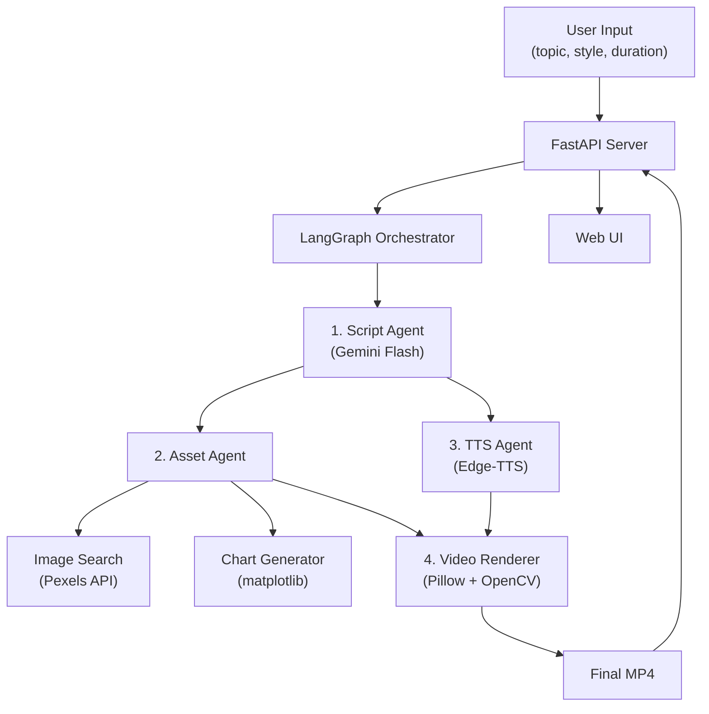

# 🎬 AI Video Generation Pipeline — Implementation Plan

## Mục tiêu

Xây dựng pipeline AI tự động tạo video training/news từ text input. User nhập topic → hệ thống tự động sinh script, tạo voice narration, tìm hình nền, render video với text overlay có hiệu ứng → xuất file MP4 hoàn chỉnh.

**Target:** Video 1 phút, chi phí < $0.05/video, thời gian render < 3 phút.

---

## User Review Required

> [!IMPORTANT]
> **Ngôn ngữ video:** Plan này thiết kế cho video **tiếng Việt** (script, voice, text overlay). Nếu bạn cần hỗ trợ đa ngôn ngữ, cần điều chỉnh scope.

> [!IMPORTANT]
> **Video style:** Kiểu "motion graphics" — text chạy trên nền hình ảnh mờ, highlight từ khóa, kèm narration. KHÔNG phải talking head hay live footage. Confirm đây đúng là style bạn muốn?

> [!WARNING]
> **ImageMagick dependency:** MoviePy cần ImageMagick để render TextClip. Tuy nhiên, plan này dùng **Pillow + OpenCV** để render frame-by-frame, tránh dependency phức tạp và kiểm soát hiệu ứng tốt hơn.

---

## Kiến trúc tổng quan



### Pipeline Flow chi tiết

```
Input: "Xu hướng AI trong giáo dục 2025"
    │
    ▼
┌─────────────────────────────────────────┐
│ Step 1: Script Generation               │
│ - Gemini Flash sinh script có cấu trúc  │
│ - Output: JSON với sections, keywords,  │
│   timing, image_queries                 │
│ - Cost: ~$0.003                         │
└────────────────┬────────────────────────┘
                 │
    ┌────────────┼────────────┐
    ▼            ▼            ▼
┌────────┐ ┌─────────┐ ┌──────────┐
│Step 2a │ │Step 2b  │ │Step 2c   │
│TTS     │ │Image    │ │Chart Gen │
│Edge-TTS│ │Search   │ │matplotlib│
│FREE    │ │Pexels   │ │FREE      │
│        │ │FREE     │ │          │
└───┬────┘ └────┬────┘ └────┬─────┘
    │           │            │
    ▼           ▼            ▼
┌─────────────────────────────────────────┐
│ Step 3: Video Assembly                   │
│ - Pillow render text frames              │
│ - Background: blurred Pexels images      │
│ - Text effects: fade, slide, highlight   │
│ - Keyword: bold, color, scale animation  │
│ - Sync with TTS audio timing             │
│ - OpenCV compile to MP4                  │
└────────────────┬────────────────────────┘
                 │
                 ▼
            📹 Final MP4
```

---

## Chi phí ước tính per video (1 phút)

| Component | Công nghệ | Chi phí |
|-----------|-----------|---------|
| Script Generation | Gemini 2.0 Flash (~2K tokens in, ~2K out) | ~$0.001 |
| Voice Synthesis | Edge-TTS (Microsoft, free) | $0.00 |
| Image Search | Pexels API (free, 200 req/hr) | $0.00 |
| Chart Generation | matplotlib (local) | $0.00 |
| Video Rendering | Pillow + OpenCV (local) | $0.00 |
| **Tổng** | | **~$0.001 - $0.01** ✅ |

> [!TIP]
> Chi phí thực tế chỉ ~$0.001-0.01 per video — rất xa dưới ngưỡng $0.2 bạn đặt ra. Điều này cho phép bạn thoải mái retry/regenerate mà không lo chi phí.

---

## Proposed Changes — Cấu trúc dự án

```
d:\Developer\Auto create Video\
├── README.md
├── requirements.txt
├── .env.example
├── config.py                    # Settings, API keys, paths
│
├── pipeline/                    # Core pipeline
│   ├── __init__.py
│   ├── orchestrator.py          # LangGraph graph definition
│   ├── state.py                 # Pipeline state schema
│   ├── nodes/                   # LangGraph nodes
│   │   ├── __init__.py
│   │   ├── script_generator.py  # Gemini Flash → structured script
│   │   ├── tts_synthesizer.py   # Edge-TTS → audio file
│   │   ├── image_searcher.py    # Pexels API → background images
│   │   ├── chart_generator.py   # matplotlib → chart images
│   │   └── video_renderer.py    # Pillow+OpenCV → final MP4
│   └── prompts/
│       └── script_prompt.py     # Prompt templates
│
├── rendering/                   # Video rendering engine
│   ├── __init__.py
│   ├── text_renderer.py         # Text overlay với hiệu ứng
│   ├── background.py            # Background blur & composition
│   ├── effects.py               # Animation effects (fade, slide, highlight)
│   └── composer.py              # Final video composition
│
├── api/                         # FastAPI layer
│   ├── __init__.py
│   ├── main.py                  # FastAPI app
│   ├── routes.py                # API endpoints
│   └── models.py                # Pydantic schemas
│
├── web/                         # Simple frontend
│   ├── index.html
│   ├── style.css
│   └── app.js
│
├── assets/                      # Static assets
│   └── fonts/
│       └── NotoSansVN-*.ttf     # Vietnamese font
│
├── output/                      # Generated videos
│   └── .gitkeep
│
└── tests/
    ├── test_script_generator.py
    ├── test_tts.py
    └── test_renderer.py
```

---

## Chi tiết Implementation

### Component 1: Pipeline State & Orchestrator

#### [NEW] [state.py](file:///d:/Developer/Auto%20create%20Video/pipeline/state.py)

Định nghĩa state schema cho LangGraph:

```python
class VideoState(TypedDict):
    # Input
    topic: str
    style: str              # "training" | "news" | "explainer"
    target_duration: int     # seconds (30, 60, 90)
    language: str            # "vi" | "en"
    
    # Script
    script: dict             # Structured script with sections
    keywords: list[str]      # Extracted keywords for highlighting
    
    # Assets
    audio_path: str          # Path to TTS audio file
    audio_duration: float    # Actual audio duration
    background_images: list[str]  # Paths to downloaded images
    chart_images: list[str]  # Paths to generated charts
    
    # Output
    video_path: str          # Final MP4 path
    status: str              # "pending" | "processing" | "completed" | "error"
    error: str               # Error message if any
```

#### [NEW] [orchestrator.py](file:///d:/Developer/Auto%20create%20Video/pipeline/orchestrator.py)

LangGraph graph với flow:

```
START → script_generator → [tts_synthesizer, image_searcher, chart_generator] → video_renderer → END
```

- `script_generator` → `tts_synthesizer` (cần script text)
- `script_generator` → `image_searcher` (cần image queries từ script)
- `script_generator` → `chart_generator` (cần data points nếu có)
- Cả 3 node trên chạy song song sau khi có script
- `video_renderer` chờ tất cả hoàn thành

---

### Component 2: Script Generator

#### [NEW] [script_generator.py](file:///d:/Developer/Auto%20create%20Video/pipeline/nodes/script_generator.py)

**Nhiệm vụ:** Nhận topic → sinh script có cấu trúc JSON.

**LLM:** Gemini 2.0 Flash (input $0.10/1M tokens, output $0.40/1M tokens)

**Output format:**
```json
{
  "title": "Xu hướng AI trong giáo dục 2025",
  "sections": [
    {
      "id": 1,
      "type": "intro",
      "narration": "Trí tuệ nhân tạo đang thay đổi cách chúng ta học...",
      "display_text": "AI đang thay đổi giáo dục",
      "keywords": ["Trí tuệ nhân tạo", "giáo dục"],
      "image_query": "artificial intelligence education classroom",
      "duration_hint": 8,
      "has_chart": false
    },
    {
      "id": 2,
      "type": "body",
      "narration": "Theo báo cáo của UNESCO, 67% trường đại học...",
      "display_text": "67% đại học ứng dụng AI",
      "keywords": ["67%", "đại học", "AI"],
      "image_query": "university technology students",
      "duration_hint": 10,
      "has_chart": true,
      "chart_data": {
        "type": "bar",
        "title": "Tỷ lệ ứng dụng AI theo năm",
        "labels": ["2022", "2023", "2024", "2025"],
        "values": [35, 48, 57, 67]
      }
    }
  ],
  "total_sections": 6,
  "estimated_duration": 60
}
```

**Prompt strategy:** Structured output với Gemini (JSON mode) → đảm bảo format chính xác, không cần parse thủ công.

---

### Component 3: TTS Synthesizer

#### [NEW] [tts_synthesizer.py](file:///d:/Developer/Auto%20create%20Video/pipeline/nodes/tts_synthesizer.py)

**Nhiệm vụ:** Script text → audio narration file (.mp3)

**Công nghệ:** `edge-tts` (free, Microsoft Edge voices)

**Vietnamese voices available:**
- `vi-VN-HoaiMyNeural` (female, natural)
- `vi-VN-NamMinhNeural` (male, natural)

**Features:**
- Generate audio per section → merge later (cho phép timing chính xác per section)
- Extract actual duration per section (dùng `pydub` hoặc `mutagen`)
- Adjustable speed/pitch

```python
import edge_tts

async def synthesize_section(text: str, voice: str = "vi-VN-HoaiMyNeural") -> str:
    communicate = edge_tts.Communicate(text, voice)
    output_path = f"output/audio_section_{uuid}.mp3"
    await communicate.save(output_path)
    return output_path
```

---

### Component 4: Image Searcher

#### [NEW] [image_searcher.py](file:///d:/Developer/Auto%20create%20Video/pipeline/nodes/image_searcher.py)

**Nhiệm vụ:** Tìm hình nền phù hợp cho mỗi section.

**API:** Pexels (free, 200 req/hr, 20K req/month)

**Logic:**
1. Lấy `image_query` từ script
2. Search Pexels API → lấy top result (landscape orientation)
3. Download & cache locally
4. Resize to video resolution (1920x1080 hoặc 1080x1920 cho vertical)

---

### Component 5: Chart Generator

#### [NEW] [chart_generator.py](file:///d:/Developer/Auto%20create%20Video/pipeline/nodes/chart_generator.py)

**Nhiệm vụ:** Tạo biểu đồ từ data trong script.

**Công nghệ:** matplotlib với custom styling (dark theme, rounded bars, gradient colors)

**Chart types hỗ trợ:**
- Bar chart (so sánh)
- Line chart (xu hướng)
- Pie chart (tỷ lệ)

**Styling:** Dark background, bright accent colors, Vietnamese font, rounded corners → phù hợp video style.

---

### Component 6: Video Renderer (Core — phần phức tạp nhất)

#### [NEW] [text_renderer.py](file:///d:/Developer/Auto%20create%20Video/rendering/text_renderer.py)

**Nhiệm vụ:** Render text overlay với hiệu ứng lên từng frame.

**Approach:** Pillow render frame-by-frame → OpenCV compile to video

**Text effects:**

| Effect | Mô tả | Dùng cho |
|--------|--------|----------|
| **Fade In/Out** | Text mờ dần xuất hiện/biến mất | Tất cả text |
| **Slide Up** | Text trượt từ dưới lên | Section title |
| **Typewriter** | Text xuất hiện từng ký tự | Narration text |
| **Highlight** | Background color pulse cho keywords | Từ khóa quan trọng |
| **Scale Pop** | Keyword zoom in rồi settle | Số liệu, % |

**Keyword highlighting:**
- Phân tích text → tìm keywords từ script
- Render keyword với: bold font, accent color (e.g., #FFD700 vàng), slight scale up
- Normal text: white, regular weight

#### [NEW] [background.py](file:///d:/Developer/Auto%20create%20Video/rendering/background.py)

**Nhiệm vụ:** Xử lý background cho mỗi section.

**Logic:**
1. Load Pexels image
2. Resize/crop to video resolution
3. Apply Gaussian blur (radius 15-20)
4. Apply dark overlay (semi-transparent black, opacity 40-60%)
5. → Tạo background mờ, đủ đẹp nhưng không distract khỏi text

#### [NEW] [composer.py](file:///d:/Developer/Auto%20create%20Video/rendering/composer.py)

**Nhiệm vụ:** Ghép tất cả layers thành video hoàn chỉnh.

**Layers (từ dưới lên):**
1. Blurred background image
2. Dark overlay
3. Display text (with effects)
4. Keywords (highlighted)
5. Chart image (nếu có, positioned center-bottom)
6. Section indicator (e.g., "1/6" ở góc)

**Audio sync:**
- Dùng actual TTS duration per section để tính timing
- Mỗi section = 1 "scene" trong video
- Transition giữa scenes: crossfade 0.5s

**Video specs:**
- Resolution: 1920x1080 (landscape) hoặc 1080x1920 (vertical/short)
- FPS: 24 (đủ smooth, tiết kiệm render time)
- Codec: H.264 (mp4v)
- Audio: AAC

---

### Component 7: FastAPI Server

#### [NEW] [main.py](file:///d:/Developer/Auto%20create%20Video/api/main.py)

**Endpoints:**

```
POST /api/generate          # Submit video generation job
GET  /api/jobs/{job_id}     # Check job status
GET  /api/jobs/{job_id}/video  # Download completed video
GET  /api/jobs               # List all jobs
```

**Job management:** Simple in-memory dict + background task (asyncio)
- Không cần database cho scope này
- Job status: pending → script_generating → assets_generating → rendering → completed/error

#### [NEW] [models.py](file:///d:/Developer/Auto%20create%20Video/api/models.py)

```python
class VideoRequest(BaseModel):
    topic: str
    style: str = "training"       # training | news | explainer
    duration: int = 60            # 30, 60, 90 seconds
    orientation: str = "landscape"  # landscape | portrait
    voice: str = "female"         # female | male

class JobStatus(BaseModel):
    job_id: str
    status: str
    progress: int                 # 0-100
    current_step: str
    video_url: Optional[str]
    created_at: datetime
```

---

### Component 8: Web UI (Tôi sẽ build cho bạn)

#### [NEW] [index.html](file:///d:/Developer/Auto%20create%20Video/web/index.html)

**Trang đơn (SPA) với 3 sections:**

1. **Input Form:**
   - Text input cho topic
   - Dropdown: style (training/news/explainer)
   - Dropdown: duration (30s/60s/90s)
   - Radio: orientation (landscape/portrait)
   - Radio: voice (male/female)
   - Submit button

2. **Progress View:**
   - Progress bar animated
   - Current step indicator (với icon)
   - Estimated time remaining

3. **Result View:**
   - Video player (HTML5 `<video>`)
   - Download button
   - "Generate another" button

**Design:** Dark mode, glassmorphism cards, gradient accents, smooth transitions.

---

## Timeline — 3 tuần

### Tuần 1: Core Pipeline (Backend)

| Ngày | Task | Deliverable |
|------|------|-------------|
| 1-2 | Setup project, config, state schema | Project skeleton chạy được |
| 3 | Script Generator + prompt engineering | Topic → structured JSON script |
| 4 | TTS Synthesizer | Script → audio files |
| 5 | Image Searcher + Chart Generator | Queries → images & charts |

**Milestone tuần 1:** Chạy `python -m pipeline.orchestrator "topic"` → ra được: script JSON + audio files + images + charts

### Tuần 2: Video Rendering + API

| Ngày | Task | Deliverable |
|------|------|-------------|
| 1-2 | Text renderer + background processor | Frame-by-frame rendering |
| 3 | Effects system (fade, slide, highlight) | Animated text overlays |
| 4 | Video composer (audio sync, transitions) | Full MP4 output |
| 5 | FastAPI server + endpoints | API chạy được |

**Milestone tuần 2:** `curl -X POST /api/generate -d '{"topic":"..."}' → job_id` → poll → download MP4

### Tuần 3: UI + Polish

| Ngày | Task | Deliverable |
|------|------|-----------|
| 1-2 | Web UI (tôi build) | Trang web hoàn chỉnh |
| 3 | Integration testing, error handling | Stable pipeline |
| 4 | Polish: thêm templates, improve prompt | Better output quality |
| 5 | Demo preparation, documentation | README, demo video |

**Final deliverable:** Trang web → nhập topic → xem progress → xem + download video

---

## Dependencies

```
# requirements.txt
# LLM & AI
langchain-google-genai>=2.0.0
langgraph>=0.2.0

# TTS
edge-tts>=6.1.0

# Image & Video
Pillow>=10.0.0
opencv-python>=4.8.0
numpy>=1.24.0
matplotlib>=3.8.0

# Audio processing
pydub>=0.25.0

# API
fastapi>=0.110.0
uvicorn>=0.27.0
python-multipart>=0.0.6

# HTTP
httpx>=0.27.0
aiofiles>=23.0.0

# Utils
python-dotenv>=1.0.0
pydantic>=2.0.0
```

---

## Open Questions

> [!IMPORTANT]
> **1. Video orientation mặc định?** Landscape (16:9) cho training, hay Portrait (9:16) cho short-form? Hay hỗ trợ cả 2?

> [!IMPORTANT]
> **2. Ngôn ngữ video:** Chỉ tiếng Việt, hay cần hỗ trợ cả tiếng Anh?

> [!NOTE]
> **3. Demo content:** Bạn có topic cụ thể nào muốn dùng làm demo không? Ví dụ: "AI trong giáo dục", "An toàn lao động"... Tôi sẽ dùng để test pipeline.

---

## Verification Plan

### Automated Tests
```bash
# Unit tests
pytest tests/ -v

# Integration test: full pipeline
python -m pipeline.orchestrator --topic "AI trong giáo dục" --output output/test.mp4

# API test
uvicorn api.main:app --reload
curl -X POST http://localhost:8000/api/generate -H "Content-Type: application/json" -d '{"topic": "AI trends"}'
```

### Manual Verification
- [ ] Video output có audio sync với text
- [ ] Keywords được highlight đúng (bold, color)
- [ ] Background images blur đúng, không bị distort
- [ ] Charts render đúng data, đẹp
- [ ] Transitions smooth giữa các sections
- [ ] Web UI responsive, progress real-time
- [ ] Error handling: network fail, API limit, invalid input

### Browser Testing
- Dùng browser tool để test Web UI end-to-end
- Verify video playback trong browser
- Test trên cả desktop và mobile viewport
