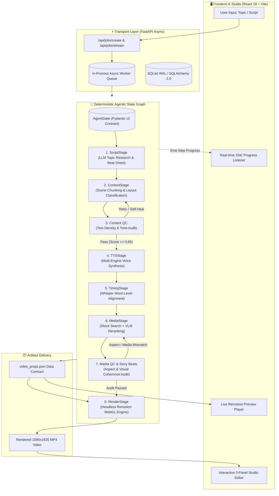

<div align="center">

# 🎬 AutoClip — AI-Driven Programmatic Video Engine
### *An End-to-End Multimodal Agentic Pipeline for Automated Short-Form Content Generation*

[](https://python.org)
[](https://fastapi.tiangolo.com)
[](https://react.dev)
[](https://remotion.dev)
[](https://www.typescriptlang.org)
[](https://docs.pydantic.dev)
[](LICENSE)

<p align="center">
  <b>Transform raw ideas or text into production-grade vertical videos (9:16) with sub-second audio-subtitle sync, intelligent VLM visual curation, and deterministic agentic state orchestration.</b>
</p>

[System Architecture](#-system-architecture) • [AI/ML Pipeline Deep-Dive](#-aiml-pipeline-deep-dive) • [Engineering Highlights](#-key-engineering-highlights) • [Tech Stack](#-technical-stack) • [Quickstart](#-quickstart--developer-guide)

</div>

---

## 📌 Executive Summary

**AutoClip** is a full-stack, multimodal video generation system designed to automate the complete content creation lifecycle—from topic research and scriptwriting to voice synthesis, visual asset ranking, audio-text forced alignment, and programmatic headless rendering.

Unlike naive script-to-video wrappers, AutoClip implements a **Deterministic Agentic State Graph** with strict Pydantic v2 data contracts, automated Quality Control (QC) self-healing loops, Vision-Language Model (VLM) asset reranking, and sub-second Whisper subtitle synchronization rendered via React Remotion.

### 🎯 Key Performance & System Metrics
- **End-to-End Generation Time:** ~30–45s for a 60-second 1080x1920 @ 30fps vertical video.
- **Audio-Subtitle Sync Latency:** Sub-10ms precision using forced word-level timestamp alignment.
- **Failure Resilience:** Automated QC stage with self-correcting retry budget and state caching (resumes without re-spending LLM/TTS credits).
- **Zero-Heavy-Infra Footprint:** Async in-process job queue with SQLite WAL mode; zero Redis/Celery bloat for local execution, cloud-ready for distributed scaling.

---

## 🏗️ System Architecture

AutoClip decouples business logic into three distinct layers:
1. **Agentic Orchestration Layer (Python / FastAPI):** State machine, LLM agents, multi-engine TTS, VLM reranker, and Whisper forced aligner.
2. **Real-time Transport Layer (SSE & REST):** Async non-blocking event streaming providing live pipeline updates to the UI.
3. **Studio & Rendering Layer (React + Remotion + WebGL):** Client-side interactive 3-panel studio editor and server-side headless video compositor.



---

## 🧠 AI/ML Pipeline Deep-Dive

### 1. Deterministic State Graph vs. Stochastic Autonomous Loops
Standard autonomous agent loops often suffer from non-deterministic runaway loops and unpredictable token expenditure. AutoClip solves this by enforcing a **Directed Acyclic Graph (DAG) state machine** with explicit state checkpoints:
- **Immutable State Contract:** Each stage receives an `AgentState` object, applies isolated transforms, and returns a new validated `model_copy`.
- **Cost & Token Auditing:** Every agent invocation tracks exact input/output tokens and cost in USD via `TokenUsage` records.
- **Smart Stage Caching:** If a job fails during rendering, restarting the pipeline skips completed LLM, TTS, and Media stages, saving 100% of upstream API costs.

### 2. Multimodal Asset Curation with VLM Reranking
Stock asset search keywords often return visually mismatched or emotionally dissonant clips. 
AutoClip implements a **Vision-Language Model (VLM) Reranking Engine**:
- Queries multiple stock engines (Pexels, Pixabay).
- Submits candidate thumbnail visual features alongside scene narration and emotional tone to a VLM (GPT-4o Vision / Qwen-Vision).
- Analyzes candidate visual semantics, subject framing (9:16 safe zone), and aesthetic harmony, outputting a weighted ranking score ($0.0 \to 1.0$) and `SceneAudit` telemetry.

```text
Candidate Visuals ──> [VLM Reranker] ──> Semantic Match Score (0.92) ──> Selected Media
                                    ──> 9:16 Framing Safe (True)
                                    ──> Narrative Sentiment Alignment
```

### 3. Sub-Second Audio-Text Forced Alignment (Whisper)
Accurate dynamic subtitles (karaoke-style animations) require microsecond-level timing:
- Synthesizes audio across **5 TTS Engines** (Edge-TTS, ElevenLabs, OpenAI TTS, Gemini Voice, Vbee).
- Passes raw WAV/MP3 streams to **OpenAI Whisper** for forced temporal alignment.
- Generates a granular `list[WordTimestamp]` mapping exact millisecond start/end intervals (`start_ms`, `end_ms`) for each spoken word, guaranteeing zero subtitle drift.

### 4. Automated Quality Control (QC Agent) & Self-Correction
Before committing to video rendering, the pipeline executes automated QC heuristics:
- **Audio-Duration Sanity:** Verifies that scene narrations fit within natural speaking cadences without audio clipping.
- **Visual Safety Check:** Detects text overflow, contrast collisions between subtitle colors and background palettes, and aspect ratio distortions.
- **Self-Healing Loop:** If a QC score falls below threshold (`QC_THRESHOLD_CONTENT = 0.85`), the stage triggers a targeted correction prompt with a strict retry quota.

---

## 🎨 Programmatic Video Engine (Remotion)

Instead of relying on rigid video templates or heavy desktop video editing software, AutoClip leverages **Remotion** (React-based programmatic video rendering):

| Scene Layout Archetype | Description & Visual Composition |
|---|---|
| `info_card` | Glassmorphism card overlays with animated icon headers and structured bullet points. |
| `stats_highlight` | Animated counter ticker highlighting key numerical metrics and growth rates. |
| `comparison` | Split-screen or dual-column layout contrasting pros/cons or competitor specs. |
| `timeline` | Sequential milestone tracker with progressive glow lines. |
| `diagram` | Mathematical formulas (LaTeX), dynamic line charts, and scatter graphs rendered via Canvas. |
| `story_beats` | Micro-idea rhythm cards with contextual emoji triggers synced to vocal inflections. |
| `cryptovn101_news` | Broadcast-style breaking news header, live ticker marquee, and source tags. |

### Dynamic Theming & Palette Generation
LLM agents dynamically extract semantic themes and generate a cohesive `ColorPalette` (Primary, Secondary, Background, Text) adhering to WCAG AAA contrast ratios.

---

## 💻 Technical Stack

```text
Auto-create-Video/
├── 🤖 AI / ML Layer
│   ├── LangGraph / StateGraph    # Deterministic pipeline state machine
│   ├── OpenAI GPT-4o / Qwen-3.5  # Scripting, Story beats, and Content parsing
│   ├── Whisper Alignment         # Word-level timestamp generation (start_ms, end_ms)
│   ├── Vision LLMs (VLM)         # Media candidate aesthetic & semantic reranking
│   └── Multi-TTS Engine          # Edge-TTS, ElevenLabs, OpenAI, Gemini, Vbee
│
├── ⚡ Backend Layer
│   ├── Python 3.13 / FastAPI    # High-throughput asynchronous HTTP REST server
│   ├── Pydantic v2               # Strict schemas and JSON data contracts
│   ├── SQLAlchemy 2.0 + SQLite   # Zero-config persistence with WAL mode concurrency
│   ├── In-Process Async Queue    # Lightweight async background worker system
│   └── Server-Sent Events (SSE)  # ContextVar-driven real-time progress emitter
│
├── 🖥️ Frontend & Studio Layer
│   ├── React 18 + TypeScript     # Component architecture with type safety
│   ├── Vite                      # Next-gen blazing fast frontend tooling
│   ├── TailwindCSS + Radix UI    # Clean, responsive dark-mode design system
│   └── Lucide Icons              # Modern UI iconography
│
└── 🎬 Rendering Engine
    ├── Remotion 4.0              # React-based programmatic video rendering
    ├── FFmpeg                    # Audio muxing, encoding, and container packaging
    └── WebGL / HTML5 Canvas      # Real-time shader animations & graph rendering
```

---

## 🛠️ Key Engineering Highlights & Trade-offs

### 1. In-Process Async Queue vs. Celery/Redis
* **Decision:** Replaced traditional Celery + Redis workers with an internal `asyncio.Queue` coupled with SQLite WAL mode.
* **Why:** Reduces developer setup friction to zero (no external daemon dependencies required for local execution) while maintaining non-blocking async execution for long-running video rendering jobs.

### 2. Strict Type Safety Across Language Boundaries
* **Challenge:** Python (`snake_case`) backend communicating with Remotion (`camelCase` TypeScript) renderer.
* **Solution:** Unified JSON Schema contract via Pydantic v2 `model_dump(by_alias=True)` on Python, validated via Zod schemas and `camelizeKeys()` on the TypeScript Remotion side.

### 3. Real-Time Observability with SSE & ContextVar
* **Challenge:** Tracking multi-stage nested worker progress without polling bottlenecks.
* **Solution:** Implemented `app/progress.py` using Python's `contextvars.ContextVar`. Any sub-node or stage can emit progress ticks with zero global state contention, instantly delivered to the frontend via `/api/jobs/stream/{job_id}`.

---

## 🚀 Quickstart & Developer Guide

### Prerequisites
- **Python:** $\ge$ 3.11
- **Node.js:** $\ge$ 18.0
- **FFmpeg:** Installed and added to system `PATH`

### 1. Clone & Configure Environment
```bash
git clone https://github.com/Duy137/Auto-create-Video.git
cd Auto-create-Video

# Copy environment template
cp .env.example .env
```

Edit `.env` with your API keys:
```env
OPENAI_API_KEY=sk-proj-...        # Required for LLM & Whisper alignment
PEXELS_API_KEY=...               # Required for stock video/image search
ELEVENLABS_API_KEY=...           # Optional: Premium voice synthesis
```

### 2. Backend Installation & Startup
```bash
# Setup Python virtual environment
python -m venv .venv
source .venv/bin/activate  # On Windows: .venv\Scripts\activate

# Install dependencies
pip install -r requirements.txt

# Start FastAPI server (Port 8000)
uvicorn api.main:app --port 8000 --reload
```

### 3. Frontend & Studio Startup
```bash
# In a new terminal:
cd web
npm install
npm run dev
```
👉 Access the **AutoClip Studio** at: `http://localhost:5173`

---

## 📡 API Reference Overview

| Endpoint | Method | Description |
|---|---|---|
| `/api/jobs/create` | `POST` | Dispatches a new video generation job (Topic or Script mode). |
| `/api/jobs/{job_id}` | `GET` | Retrieves job status, current state, and artifact URLs. |
| `/api/jobs/stream/{job_id}` | `GET` | Real-time Server-Sent Events (SSE) progress stream. |
| `/api/jobs/{job_id}/render` | `POST` | Triggers Remotion headless render with custom edited `video_props`. |
| `/api/media/search` | `GET` | Searches stock assets with keyword fallback and pagination. |
| `/api/audio/tts-preview` | `POST` | Generates on-the-fly voice sample previews for UI selection. |

---

## 👨‍💻 Engineering Author & Portfolio Contact

- **Author:** AI / Full-Stack Engineer
- **Focus Areas:** Multimodal AI, Agentic State Machines, Audio-Visual Synthesis, High-Performance Async Architectures.
- **GitHub:** [@Duy137](https://github.com/Duy137)

---
<div align="center">
  <sub>Built with precision for scalable, automated AI content generation.</sub>
</div>
